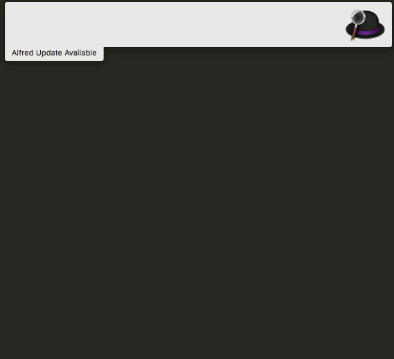
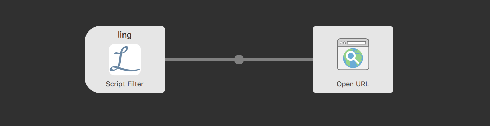

# Linguee Worklow for Alfred

An Alfred workflow to translate French to English words using Linguee

# Demo

# Development

Inspired by (https://github.com/alexander-heimbuch/linguee-alfred-workflow)[https://github.com/alexander-heimbuch/linguee-alfred-workflow]

Use `env GOOS=darwin GOARCH=amd64 go build linguee.go` to compile the project.

## Workflow

